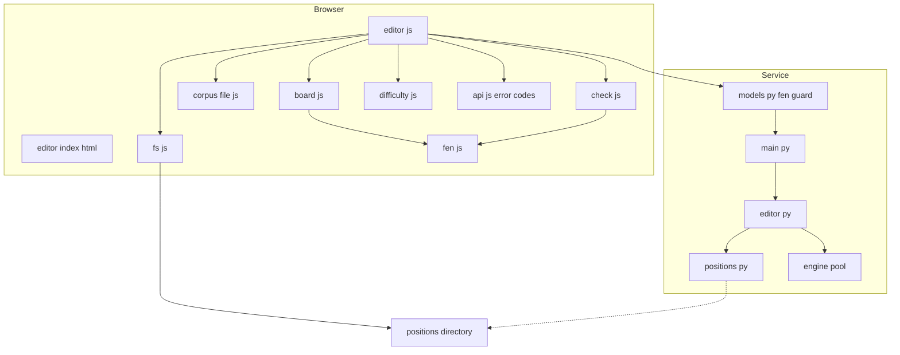
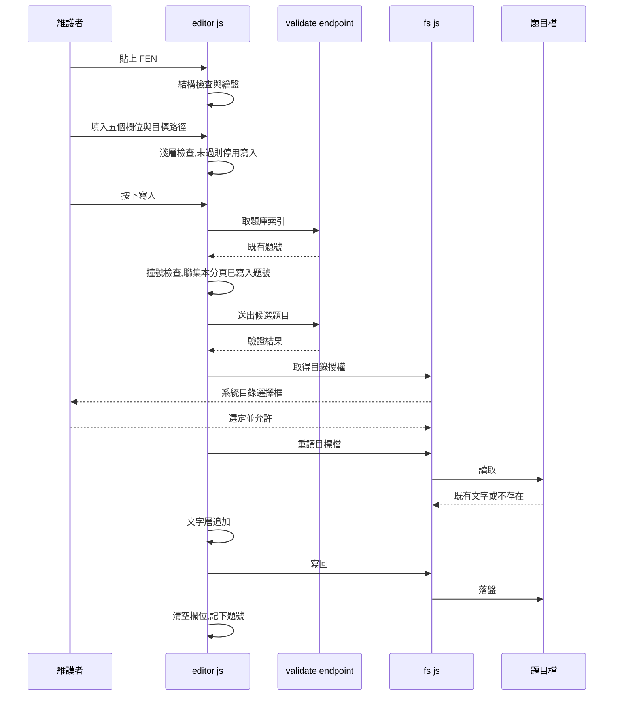

# Design Document: corpus-editor

## Overview

**Purpose**:本功能為題庫維護者提供收題工具,把「手打 JSON 收題」這件事變成畫面上看得見、送出前擋得住的流程。貼上 FEN 立刻畫出盤面供肉眼核對,五個欄位填齊並通過驗證後,一鍵把新題附加進指定的題目檔。

**Users**:題庫維護者(目前為單人)。工具只由網址進入,產品的列表頁與對局頁不提供任何入口。

**Impact**:`web/` 新增一個獨立的頁面目錄 `web/editor/`;`service/` 新增一個**唯讀**的候選題目驗證端點。服務端**不取得任何寫入題庫的能力** —— 檔案由瀏覽器透過 File System Access API 直接寫入,上線題庫仍只經由 git commit 進版本庫。

收題頁**不設存取控制**:它能寫的只有使用者自己以系統對話框選定的本機目錄,伺服器的題庫碰不到,因此頁面被公開存取不構成風險。驗證端點同理不設開關 —— 它只列出合法著法、不搜尋、不回評分,成本低於既有且已公開的對局端點。**真正新增的風險是它讓使用者文字第一次到達引擎的輸入**,對策是字元層級的把關而非存取控制。

### Goals

- 貼上的 FEN 能被即時、正確地畫成盤面,且盤面完全不可互動
- 所有會讓服務啟動失敗的資料錯誤,在寫入之前就被擋下並定位到欄位
- 寫入後目標檔中既有的每一題**逐字不變**,排版與既有題目檔同形
- 使用者輸入的 FEN 在**進入路由函式之前**就被字元層級擋下,不可能改變送往引擎的指令結構

### Non-Goals

- 修改或刪除既有題目 —— 本工具只新增
- 判斷題目是否紅先必勝、產生或回填 `max_dtm` —— 屬 corpus-verification
- 圖形化擺子產生 FEN —— 本輪只接受貼上的 FEN 字串
- 跨頁面重載保留目錄授權 —— 平台的寫入權限本就隨分頁關閉而失效
- 服務端寫入題庫的任何能力
- 支援 Firefox 與 Safari —— 兩者不實作本機目錄選取,已知且接受

## Boundary Commitments

### This Spec Owns

- `web/editor/` 底下的全部內容:收題頁的版面、表單、淺層檢查、JSON 序列化與文字追加、File System Access API 的包裝
- `service/editor.py`:候選題目的權威驗證(題目 schema + 引擎可載入性),**唯讀**
- `POST /api/editor/validate` 的契約
- **送往引擎的 FEN 字元把關**:合法字元集、長度上限,以及它攔截的位置
- 「一題如何被序列化成題庫檔中的文字」這件事的正確性
- **對 `service/main.py`、`service/models.py`、`service/positions.py` 的改動**,且**一律為附加式**:新增一條路由註冊、新增請求模型與其欄位驗證器、新增一個公開驗證包裝。三者的既有行為與契約不得因本 spec 改變,改動範圍以 File Structure Plan 的 Modified Files 為窮舉清單

### Out of Boundary

- **題目 schema 的定義權** —— 屬 `structure.md` 與 position-corpus。本 spec 驗證時**呼叫** `service/positions.py` 的既有實作,不複製也不擴充規則
- **難度三級制的定義** —— 屬 `structure.md`;前端選項自 `web/difficulty.js` 產生
- **象棋規則** —— 局面是否合法一律由引擎判定,本 spec 不實作任何棋規
- **`web/fen.js`、`web/board.js`、`web/difficulty.js`、`web/api.js` 的既有行為** —— 只匯入,不修改。特別是 `parseFen()` 的寬鬆解析是對局路徑的既有契約,不得為本 spec 收緊
- **題庫內容本身**、`max_dtm` 與任何驗證工具回填的欄位
- **服務層級的速率限制與濫用防護** —— 屬 service-deploy-ops。本 spec 的字元把關解的是注入,不是流量
- **既有對局路徑的 FEN 來源**(取自題庫,受信任)—— 本 spec 只把關新增端點上的使用者輸入
- **對局與題庫列表的任何行為**

### Allowed Dependencies

- 前端:`web/fen.js`(`parseFen`、`FILES`、`RANKS`)、`web/board.js`(`renderBoard`)、`web/difficulty.js`(`DIFFICULTY_LABELS`)、`web/api.js`(`ApiErrorCode`)—— 全部唯讀匯入
- 後端:`service/positions.py`(新增的公開驗證包裝)、`service/engine/pool.py`(借引擎)、`service/models.py`(請求模型)、`service/config.py`(逾時設定,唯讀取用)、`service/errors.py`
- 平台:File System Access API(`showDirectoryPicker` 及其控制代碼)
- **依賴方向不變**:`types / errors -> config -> positions / engine -> game | editor -> models -> main`。`service/editor.py` 與 `game.py` 同層,**不得互相匯入**

### Revalidation Triggers

以下改動須讓下游或相鄰 spec 重新確認整合:

- 題目 schema 的欄位增減或型別變更(`structure.md` / `service/positions.py`)→ 序列化器與後端驗證同時受影響
- 既有題目檔的排版慣例改變(縮排、`tags` 是否單行)→ 序列化器的回歸比對會先紅
- `renderBoard()` 的參數語意改變,特別是「空 `legalMoves` 即不可選取」→ 唯讀盤面的成立基礎
- 引擎抽象介面 `legal_moves` 的簽章改變
- **引擎指令的組裝方式改變**(`_position_command` 的行導向前提)→ FEN 字元把關的必要字元集可能隨之改變
- **任何新增的、接受使用者提供 FEN 或走法的端點** → 須沿用同一道字元把關,不得各自為政

## Architecture

### Existing Architecture Analysis

- **前端無建置步驟**(`tech.md`):vanilla JS + ES module + SVG,`.js` 與 `.html` 直接就是交付物。收題頁沿用此形態,不引入任何工具鏈。
- **既有模組分層**:`fen.js`(純函式、最左端)→ `board.js`(繪製)→ `app.js`(組裝與 DOM)。收題頁採同一分層。
- **`renderBoard` 的可選取語意**:可選取的定義是「傳入的著法裡有自該格出發的」。傳空陣列時整片盤面不可選,**唯讀盤面因此是既有模組的自然狀態,不需要新增參數**。
- **格式驗證攔在路由函式之前**:`service/main.py` 的模組說明明載此為刻意設計 —— 請求模型宣告為主體參數,「格式不合法的請求從未進入函式本體」。既有的 `UCI_MOVE_PATTERN` 加 `field_validator` 即此形狀。**FEN 字元把關沿用同一位置與同一錯誤類別**,不另建一套。
- **`service/positions.py` 標明「唯讀」**:本設計維持此契約 —— 新增的公開包裝只驗證並回傳 `Position`,不碰檔案系統。
- **`_position_command()` 是裸的字串插值**(`f"position fen {fen}"`),且引擎協定為行導向。既有路徑安全是因為 FEN 一律來自題庫;本 spec 是第一條使用者 FEN 進入此處的路徑,把關因此是新增的必要件而非既有缺陷的修補。

### Architecture Pattern & Boundary Map



**Architecture Integration**:

- **Selected pattern**:既有前端分層(純函式 → 呈現 → 組裝)加上一個後端唯讀驗證服務。不引入新的架構概念,也不引入存取控制機制。
- **Domain boundaries**:寫入路徑**只有一條**,即 `fs js -> positions directory`;服務端到題庫的箭頭是虛線且僅為啟動時的讀取。這條不對稱是本設計的核心保證,不是實作細節。
- **輸入把關在路由之前**:圖上 `models py` 位於 `main py` 之前,不是排版而是**執行順序** —— 字元不合格的 FEN 不會進入路由函式,因此連借引擎那一步都沒有機會發生。
- **判定與寫入分離**:候選題目**是否合格**由服務端判定(唯一權威),**寫入動作**由瀏覽器執行(服務端無此能力)。兩者刻意分屬不同進程。
- **Existing patterns preserved**:純函式模組不碰 DOM 且可由 `page.evaluate()` 單獨驗證;錯誤分類沿用 `ApiErrorCode`;設定沿用 `LEETCHESS_` 前綴的凍結 dataclass。
- **Steering compliance**:不自行實作棋規(合法性問引擎);使用者可見文字繁體中文,難度說法沿用既有例外;無 node 工具鏈。

### Technology Stack

| Layer | Choice / Version | Role in Feature | Notes |
|-------|------------------|-----------------|-------|
| Frontend | vanilla JS ES modules + SVG | 收題頁的全部行為 | 無新增依賴,無建置步驟 |
| Frontend 平台 API | File System Access API | 目錄授權與檔案讀寫 | Chrome / Edge / Opera 86+;Firefox 與 Safari 不支援 |
| Backend | FastAPI(既有版本) | 候選題目的驗證端點與 FEN 字元把關 | 無新增套件 |
| Backend 驗證 | `service/positions.py` 既有實作 | 題目 schema 的唯一權威 | 加一層公開包裝,規則不複製 |
| Engine | Pikafish(既有版本鎖定) | 裸 FEN 的可載入性判定 | 重用 `legal_moves`,不改引擎層 |
| Test | pytest + Playwright(chromium) | 前後端驗證 | 沿用既有夾具 |

## File Structure Plan

### Directory Structure

```
web/
└── editor/                   # 收題頁。集中於單一目錄,與產品頁面互不牽動
    ├── index.html            # 版面容器:左盤右表單,無邏輯無樣式
    ├── editor.css            # 收題頁專屬版面。須自帶盤面的尺寸規則(對局頁的
    │                         # `#board svg` 那組在 style.css,不會套到本頁)
    ├── editor.js             # 組裝與 DOM:事件、狀態、呼叫其餘三個模組
    ├── check.js              # 純函式:表單淺層檢查、FEN 結構檢查、路徑檢查、描述建議值
    ├── corpus-file.js        # 純函式:一題的序列化、追加到既有檔案文字
    └── fs.js                 # File System Access API 的唯一接觸點

service/
└── editor.py                 # 候選題目的權威驗證。與 game.py 同層,唯讀

tests/
├── test_editor_service.py     # service/editor.py 與 validate_position()
├── test_editor_endpoint.py    # 驗證端點,含 FEN 字元把關的拒絕路徑
├── test_web_editor_pure.py    # check.js 與 corpus-file.js 的純函式,經 page.evaluate()
├── test_web_editor.py         # 收題頁的互動與失敗路徑
└── test_web_editor_entry.py   # 產品頁面不含收題頁入口的回歸檢查
```

### Modified Files

- `service/models.py` — 新增驗證端點的請求模型、`FEN_PATTERN` 與其欄位驗證器。**沿用 `UCI_MOVE_PATTERN` 加 `field_validator` 的既有形狀**,錯誤類別相同
- `service/main.py` — 註冊 editor 路由;啟動掛鉤建立 `EditorService`
- `service/positions.py` — 新增公開函式 `validate_position()`,是既有 `_read_position()` 的薄包裝。**模組的「唯讀」契約不變**

> `web/fen.js`、`web/board.js`、`web/difficulty.js`、`web/api.js`、`web/style.css`、`service/config.py`、`service/game.py`、`service/engine/` **一律不修改**。`_WebFiles` 的既有遮蔽規則不變 —— 收題頁是普通靜態內容。

## System Flows

### 寫入一題的完整流程



**流程層級的決定**:

- **授權請求發生在按下寫入之後**,不在頁面載入時 —— 平台要求授權必須由使用者手勢觸發,且 6.4 要求未授權前仍可繪盤與填寫。
- **目標檔在授權之後才重讀**,不在填表時先讀 —— 把「讀檔到寫檔」的視窗壓到最小,降低期間被外部改動而遭覆蓋的風險。
- **撞號檢查與候選驗證都在取得授權之前完成** —— 不合格的題目不該讓使用者先跳一次目錄選擇框。
- **本分頁已寫入題號只在寫入成功後才記下** —— 失敗的嘗試不得佔用題號。

## Requirements Traceability

| Requirement | Summary | Components | Interfaces | Flows |
|-------------|---------|------------|------------|-------|
| 1.1, 1.2 | 只由網址進入,產品頁無入口 | `web/editor/index.html` | 靜態路徑 `/editor/` | — |
| 1.3 | 既有功能不受新增能力影響 | `service/main.py` | 既有四端點與靜態掛載不變 | — |
| 2.1, 2.2, 2.5 | 貼上即重繪、紅方在下、清空即空盤 | `editor.js`、`board.js`(重用) | `renderBoard` | 寫入流程前段 |
| 2.3 | 盤面不可互動 | `board.js`(重用) | `renderBoard` 傳空 `legalMoves` | — |
| 2.4 | 無法解析要顯示訊息且不留舊盤面 | `check.js` | `checkFenStructure` | — |
| 2.6 | 起手方由 FEN 顯示,無獨立輸入 | `editor.js`、`check.js` | `sideFromFen` | — |
| 3.1, 3.3, 3.8 | 五欄位、多標籤、描述可換行 | `web/editor/index.html`、`editor.js` | DOM 契約 | — |
| 3.2 | 難度三選一 | `editor.js`、`difficulty.js`(重用) | `DIFFICULTY_LABELS` | — |
| 3.4, 3.5 | 不提供 `max_dtm` 與出處輸入 | `web/editor/index.html` | DOM 契約 | — |
| 3.6, 3.7 | 描述建議值,可自由改寫 | `check.js` | `suggestDescription` | — |
| 4.1, 4.2, 4.6 | 必填、題號正整數、標籤至少一個 | `check.js` | `checkForm` | 淺層檢查 |
| 4.3, 4.4, 4.5 | 撞號檢查含本分頁已寫入者 | `editor.js` | `GET /api/catalog` + 分頁內集合 | 寫入流程 |
| 4.7, 4.8, 4.9 | 權威驗證與引擎可載入性;確認失敗即不寫入 | `service/editor.py` | `POST /api/editor/validate` | 寫入流程 |
| 4.10 | 不判斷紅先必勝 | `service/editor.py` | 驗證僅涵蓋 schema 與可載入性 | — |
| 5.1, 5.2, 5.3 | 路徑輸入與範圍限制 | `check.js` | `checkTargetPath` | — |
| 5.4, 5.5, 5.6 | 新建、追加、非陣列即拒絕 | `corpus-file.js` | `appendPosition` | 寫入流程 |
| 5.7 | 既有題目逐字不變 | `corpus-file.js` | 文字層追加 | 寫入流程 |
| 5.8, 5.9 | 排版一致、只寫 schema 欄位 | `corpus-file.js` | `serializePosition` | — |
| 6.1, 6.2 | 首次寫入才請求授權;拒絕時保留內容 | `fs.js`、`editor.js` | `acquireCorpusDirectory` | 寫入流程 |
| 6.3 | 不支援的瀏覽器要明講 | `fs.js`、`editor.js` | `isSupported` | — |
| 6.4 | 未授權前仍可繪盤與填寫 | `editor.js` | 狀態機 | — |
| 7.1, 7.2, 7.3 | 成功訊息、清空欄位保留路徑、失敗保留內容 | `editor.js` | 狀態機 | 寫入流程末段 |
| 7.4, 7.5, 7.6 | 不改不刪、不提供編修操作 | `corpus-file.js`、`web/editor/index.html` | 文字層追加;無編修 DOM | — |
| 8.1, 8.2 | 左盤右表單、盤面外觀一致 | `editor.css`、`board.js`(重用) | — | — |
| 8.3 | 繁體中文與難度例外 | 全前端模組 | `DIFFICULTY_LABELS` | — |
| 8.4 | 指出是哪一項未通過 | `check.js`、`editor.js` | `CheckIssue` 清單 | — |
| 9.1, 9.2, 9.3 | 控制字元、非法字元、超長 FEN 一律拒絕且不送往引擎 | `service/models.py` | `FEN_PATTERN` 欄位驗證器 | 攔在路由函式之前 |
| 9.4 | 沿用既有著法格式驗證的錯誤類別 | `service/models.py` | `INVALID_MOVE_FORMAT` | — |
| 9.5 | 此檢查不判定局面合法性 | `service/models.py`、`service/editor.py` | 字元集把關與引擎判定分屬兩層 | — |

## Components and Interfaces

| Component | Domain/Layer | Intent | Req Coverage | Key Dependencies (P0/P1) | Contracts |
|-----------|--------------|--------|--------------|--------------------------|-----------|
| `check.js` | 前端 / 純函式 | 表單與路徑的淺層檢查、描述建議值 | 2.4, 2.6, 3.6, 3.7, 4.1, 4.2, 4.6, 5.1–5.3, 8.4 | `fen.js` (P1) | Service |
| `corpus-file.js` | 前端 / 純函式 | 一題的序列化與文字層追加 | 5.4–5.9, 7.4 | 無 | Service |
| `fs.js` | 前端 / 平台包裝 | File System Access API 的唯一接觸點 | 6.1–6.3 | File System Access API (P0) | Service |
| `editor.js` | 前端 / 組裝 | 事件、狀態、DOM 更新 | 2.1–2.6, 3.x, 4.3–4.5, 6.4, 7.1–7.3, 8.4 | 上述三者 (P0)、`board.js` (P0)、`difficulty.js` (P1)、`api.js` (P1) | State |
| `web/editor/index.html` | 前端 / 版面 | 容器與表單欄位 | 1.1, 3.1, 3.4, 3.5, 3.8, 7.6, 8.1 | 無 | — |
| `editor.css` | 前端 / 版面 | 左盤右表單 | 8.1, 8.2 | 既有 CSS 變數 (P2) | — |
| `service/editor.py` | 後端 / 服務 | 候選題目的權威驗證 | 4.7–4.10 | `positions.py` (P0)、引擎池 (P0) | Service, API |
| `service/models.py`(修改) | 後端 / 契約 | 請求模型與 FEN 字元把關 | 9.1, 9.2, 9.3, 9.4, 9.5 | 無 | API |
| `service/main.py`(修改) | 後端 / 組裝 | 路由註冊與驗證服務建立 | 1.3 | `service/editor.py` (P0) | API |

### 前端 / 純函式層

#### check.js

| Field | Detail |
|-------|--------|
| Intent | 把表單當下的值翻成一份「哪裡還不對」的清單,不碰 DOM、不發請求 |
| Requirements | 2.4, 2.6, 3.6, 3.7, 4.1, 4.2, 4.6, 5.1, 5.2, 5.3, 8.4 |

**Responsibilities & Constraints**

- **只做淺層檢查**,即「填了沒、形狀對不對」。題目是否真的合 schema 由服務端判定(見 `service/editor.py`)——本模組**永遠不是放行判準**
- 不得複製 `service/positions.py` 的規則;兩者若對同一個輸入給出不同結論,以服務端為準
- 純函式:相同輸入必得相同輸出,不讀取全域狀態

**Dependencies**

- Outbound:`web/fen.js` — 取用 `FILES` / `RANKS` 常數(P1)

**Contracts**: Service [x] / API [ ] / Event [ ] / Batch [ ] / State [ ]

##### Service Interface

```typescript
/** 一項未通過的檢查。`field` 對應表單欄位名,`null` 表示不屬於任一欄位。 */
interface CheckIssue {
  field: 'id' | 'title' | 'description' | 'difficulty' | 'tags' | 'fen' | 'target' | null;
  message: string;
}

/** 表單的原始字串值,未經任何轉換。 */
interface FormValues {
  id: string;
  title: string;
  description: string;
  difficulty: string;
  tags: string;
  fen: string;
  target: string;
}

interface CheckModule {
  /** 全部淺層檢查,回傳清單;空清單代表淺層無異議。 */
  checkForm(values: FormValues): CheckIssue[];
  /** FEN 的結構檢查:列數、每列格數、走子方欄位。 */
  checkFenStructure(fen: string): CheckIssue | null;
  /** 目標路徑:須在題庫目錄內、須位於書目資料夾內、須為 .json。 */
  checkTargetPath(target: string): CheckIssue | null;
  /** 把標籤輸入切成陣列,去除空白與空項。 */
  parseTags(raw: string): string[];
  /** 由 FEN 的走子方欄位取得起手方顯示字樣;無法判定時回 null。 */
  sideFromFen(fen: string): '紅先' | '黑先' | null;
  /** 描述的建議值,例如「適情雅趣 第二五局 患在几席」。 */
  suggestDescription(source: string, id: number, title: string): string;
}
```

- **Preconditions**:無。任何字串輸入都必須有定義的行為,包含空字串
- **Postconditions**:`checkForm` 的清單順序與表單欄位順序一致,使 8.4 的呈現有穩定次序
- **Invariants**:不拋出例外 —— 檢查失敗以回傳值表達

**Implementation Notes**

- Integration:`checkTargetPath` 的「書目資料夾內」判準為路徑至少兩段(資料夾 + 檔名),與 `service/positions.py` 的 `_source_of_path()` 同一條規則。**該規則的權威在後端**,此處是為了在送出前就給回饋
- Validation:`suggestDescription` 的局號採逐字中文數字(`25` → 「二五」),與既有題目的寫法一致,非「二十五」
- Risks:路徑檢查若與後端判準漂移,後果是使用者被前端擋下但後端本可接受 —— 方向安全(偏保守),不會讓壞資料通過

#### corpus-file.js

| Field | Detail |
|-------|--------|
| Intent | 決定「一題在題庫檔中長什麼樣」,以及如何把它接到既有檔案文字之後 |
| Requirements | 5.4, 5.5, 5.6, 5.7, 5.8, 5.9, 7.4 |

**Responsibilities & Constraints**

- **既有內容不重新序列化。** 追加以文字層進行:定位收尾的 `]`,在其前插入新題的文字。既有位元組因此**沒有被重寫的機會**,5.7 是構造上的事實而非需要證明的性質
- `JSON.parse` 只用於**驗證**目標檔可解析為陣列(5.6),其結果不參與輸出
- 序列化只涵蓋題目 schema 定義的欄位(5.9),`max_dtm` 不由本工具寫入
- 純函式:不碰檔案系統,輸入輸出皆為字串

**Dependencies**

- 無

**Contracts**: Service [x] / API [ ] / Event [ ] / Batch [ ] / State [ ]

##### Service Interface

```typescript
/** 要寫進題庫檔的一題。欄位集合即題目 schema 的人工編輯欄位。 */
interface PositionEntry {
  id: number;
  title: string;
  description: string;
  fen: string;
  difficulty: number;
  tags: string[];
}

/** 目標檔內容不是題目陣列時拋出。 */
declare class CorpusFileError extends Error {}

interface CorpusFileModule {
  /** 一題的文字,含兩格縮排。tags 保持單行,中文不轉義。 */
  serializePosition(entry: PositionEntry): string;
  /**
   * 追加一題並回傳新的檔案全文。
   * @param existing 目標檔既有全文;檔案不存在時傳 null。
   * @throws CorpusFileError 既有內容無法解析為 JSON 陣列。
   */
  appendPosition(existing: string | null, entry: PositionEntry): string;
}
```

- **Preconditions**:`entry` 的欄位已通過服務端驗證。本模組不重複驗證
- **Postconditions**:
  - `existing` 為 `null` 時,輸出為只含一個元素的陣列(5.4)
  - `existing` 為既有陣列時,**輸出以 `existing` 的每一個位元組為前綴**,直到收尾的 `]` 之前(5.7)
  - 輸出以換行結尾,與既有題目檔一致
- **Invariants**:`appendPosition` 絕不移除或改寫 `existing` 中的任何字元

**Implementation Notes**

- Integration:需處理的既有文字形態有三種 —— 空陣列 `[]`(無前一個元素,不補逗號)、非空陣列(為前一個元素補逗號)、檔案不存在(`null`)。三種皆以測試釘住
- Validation:序列化的正確性以**既有題庫檔回歸比對**驗證 —— 讀入每一個既有題目檔的每一題,重新序列化,與原檔對應片段比對。新增書目或改動排版慣例時該測試會先紅
- Risks:目標檔若含註解或尾隨逗號等非標準 JSON,`JSON.parse` 會失敗並轉為 `CorpusFileError`,寫入不成立。這是要的行為 —— 題庫檔本就必須是標準 JSON

### 前端 / 平台包裝層

#### fs.js

| Field | Detail |
|-------|--------|
| Intent | File System Access API 的**唯一**接觸點,使其餘模組可在無此 API 的環境下被測試 |
| Requirements | 6.1, 6.2, 6.3 |

**Responsibilities & Constraints**

- 集中平台 API 的呼叫;`editor.js` 不直接觸碰 `showDirectoryPicker` 或控制代碼
- 目錄控制代碼**只存在模組層變數中**,不進 IndexedDB —— 平台的寫入權限本就隨分頁關閉而失效,持久化救不回權限(見 `research.md` Decision 4)
- 授權請求必須在使用者手勢的呼叫堆疊內發生

**Dependencies**

- External:File System Access API — 目錄選取與檔案讀寫(P0)

**Contracts**: Service [x] / API [ ] / Event [ ] / Batch [ ] / State [ ]

##### Service Interface

```typescript
/** 平台不支援本機目錄選取時拋出。 */
declare class UnsupportedBrowserError extends Error {}
/** 使用者拒絕授權或取消目錄選擇時拋出。 */
declare class PermissionDeniedError extends Error {}

interface FsModule {
  /** 目前瀏覽器是否提供本機目錄選取。 */
  isSupported(): boolean;
  /**
   * 取得題庫目錄的控制代碼。已取得者直接回傳,不重複詢問。
   * 必須自使用者手勢觸發。
   */
  acquireCorpusDirectory(): Promise<FileSystemDirectoryHandle>;
  /** 讀取相對路徑的檔案全文;檔案不存在時回傳 null。 */
  readTextAt(dir: FileSystemDirectoryHandle, relativePath: string): Promise<string | null>;
  /** 寫入相對路徑的檔案,必要時建立中間資料夾以外的目標檔。 */
  writeTextAt(dir: FileSystemDirectoryHandle, relativePath: string, text: string): Promise<void>;
}
```

- **Preconditions**:`acquireCorpusDirectory` 只能於使用者手勢的處理常式內呼叫
- **Postconditions**:`writeTextAt` 回傳時內容已落盤(串流已 `close()`)
- **Invariants**:同一分頁內只詢問一次目錄;`readTextAt` 對不存在的檔案回傳 `null` 而非拋出

**Implementation Notes**

- Integration:`writeTextAt` 對既有檔案採**整檔覆寫**,內容為 `appendPosition` 的輸出。既有題目的不變性由該輸出保證,不由寫入方式保證
- Validation:`isSupported` 於頁面載入時即評估,不支援時 6.3 的訊息立刻呈現而非等到按下寫入
- Risks:讀檔與寫檔之間目標檔若被外部改動(編輯器、git 操作),追加會覆蓋該次改動。以「按下寫入時才重讀」把視窗壓到最小;不建鎖機制 —— 單人本機工具,代價不成比例

### 前端 / 組裝層

#### editor.js

| Field | Detail |
|-------|--------|
| Intent | 事件接線、頁面狀態、DOM 更新。唯一知道 DOM 存在的模組 |
| Requirements | 2.1–2.6, 3.1–3.3, 3.6–3.8, 4.3–4.5, 6.4, 7.1–7.3, 8.4 |

**Responsibilities & Constraints**

- 持有頁面狀態:目錄控制代碼是否已取得、**本分頁已成功寫入的題號集合**、當前的檢查清單
- 不實作任何檢查規則、不實作序列化、不直接呼叫平台 API —— 三者各由專屬模組承擔
- 難度選項自 `DIFFICULTY_LABELS` 產生,不在此另寫一份說法

**Dependencies**

- Outbound:`check.js`、`corpus-file.js`、`fs.js`(P0);`board.js`、`fen.js`(P0);`difficulty.js`(P1);`api.js` 的 `ApiErrorCode`(P1)
- Outbound:`GET /api/catalog`(既有端點,取既有題號)、`POST /api/editor/validate`(P0)

**Contracts**: Service [ ] / API [ ] / Event [ ] / Batch [ ] / State [x]

##### State Management

- **狀態模型**:
  - `directory: FileSystemDirectoryHandle | null` — 分頁存續期間有效
  - `writtenIds: Set<number>` — **只在寫入成功後加入**,失敗的嘗試不佔用題號(4.4)
  - `issues: CheckIssue[]` — 當前未通過的檢查,驅動 8.4 的呈現與寫入按鈕的停用
- **持久化**:無。收題頁不寫 localStorage,也不持久化控制代碼
- **併發**:寫入期間停用寫入按鈕,避免重複送出

**Implementation Notes**

- Integration:寫入序列為「取索引 → 撞號 → 送驗證 → 取授權 → 重讀目標檔 → 追加 → 寫回 → 記下題號並清空欄位」。前三步在授權之前完成,不合格的題目不讓使用者先跳一次目錄選擇框
- Validation:FEN 輸入的每一次變動都重跑 `checkFenStructure` 並重繪;結構不合法時清掉盤面而非留著上一個(2.4)
- Risks:`GET /api/catalog` 在服務重啟期間可能失敗。此時寫入不成立,落在 7.3 的一般失敗處理 —— 這是移除原 4.10 之後刻意接受的歸屬,**不另立分支**

### 後端 / 服務層

#### service/editor.py

| Field | Detail |
|-------|--------|
| Intent | 候選題目的**權威**驗證:題目 schema 加引擎可載入性 |
| Requirements | 4.7, 4.8, 4.9, 4.10 |

**Responsibilities & Constraints**

- **唯讀。** 不寫入任何檔案,不改變任何服務狀態。`positions.py` 的「唯讀」契約在本模組亦成立
- schema 判定**呼叫** `positions.validate_position()`,不複製規則(見 `research.md` Decision 1)
- 引擎可載入性判定為「借一個引擎,對該 FEN 與空走法序列取合法著法」。取得任何結果即視為可載入
- **抵達本模組的 FEN 已通過字元把關**(見 `service/models.py`):請求模型在路由函式被呼叫之前就擋掉了控制字元與超長輸入。本模組因此不重做字元檢查,但也**不得**成為繞過它的入口 —— 任何未來的呼叫端都必須經由同一個請求模型進來
- **不判斷紅先必勝**(4.10),不執行長時間搜尋
- 與 `game.py` 同層,兩者**不得互相匯入**

**Dependencies**

- Outbound:`service/positions.py` — schema 驗證(P0)
- Outbound:`service/engine/pool.py` — 借引擎(P0)
- Outbound:`service/config.py` — 搜尋逾時(P1)

**Contracts**: Service [x] / API [x] / Event [ ] / Batch [ ] / State [ ]

##### Service Interface

```python
@dataclass(frozen=True)
class ValidationIssue:
    """一項未通過的驗證。`field` 為題目 schema 的欄位名,None 表示不屬於任一欄位。"""
    field: str | None
    message: str


class EditorService:
    def __init__(self, pool: EnginePool, settings: Settings) -> None: ...

    def validate(self, raw: object) -> list[ValidationIssue]:
        """驗證候選題目。回傳空清單代表合格。

        兩道檢查依序進行:題目 schema,而後引擎可載入性。schema 未通過時
        **不借引擎** —— 欄位都不對的題目沒有問到引擎的必要。
        """
```

- **Preconditions**:`raw` 為任意 JSON 可解碼的值,包含非物件
- **Postconditions**:回傳清單為空時,該候選題目必能被 `PositionRepository.load()` 接受,且其 FEN 引擎載入得進去
- **Invariants**:不改變檔案系統或服務狀態;不拋出驗證性質的例外(以回傳值表達)

##### API Contract

| Method | Endpoint | Request | Response | Errors |
|--------|----------|---------|----------|--------|
| POST | `/api/editor/validate` | `{"position": <object>}` | `{"valid": bool, "issues": [{"field": str \| null, "message": str}]}` | 400, 503, 504, 500 |

- **驗證未通過是「結果」而非「錯誤」**:回應為 200 加上 `valid: false`。這使既有的七種錯誤類別碼不必為本功能擴充第八種
- 既有錯誤類別碼只用於**真正的服務失敗**:引擎池滿(`SERVICE_BUSY` / 503)、搜尋逾時(`ENGINE_TIMEOUT` / 504)、未預期失敗(`INTERNAL` / 500)
- **FEN 字元不合格是唯一的例外**:它以 `INVALID_MOVE_FORMAT`(400)表達,且發生在路由函式被呼叫**之前** —— 那不是「這一題不合格」的結果,而是請求本身不該被處理。這與既有著法格式驗證的處置完全相同

**Implementation Notes**

- Integration:`positions.validate_position()` 是 `_read_position()` 的薄包裝,`where` 標籤固定為「候選題目」。**規則只有一份**
- Validation:schema 失敗時 `ValueError` 的訊息即為 `ValidationIssue.message`;欄位歸屬由訊息中的欄位名推得,推不出時 `field` 為 `None`
- Risks:引擎池被收題頁佔用會影響對局。收題是低頻的人工操作,且本端點只做 `go perft 1`,遠比既有的對局端點便宜 —— 不另設配額;整體的速率限制屬 service-deploy-ops

### 後端 / 設定與組裝

#### service/models.py(修改)

| Field | Detail |
|-------|--------|
| Intent | 驗證端點的請求形狀,以及**送往引擎之前**的 FEN 字元把關 |
| Requirements | 9.1, 9.2, 9.3, 9.4, 9.5 |

**Responsibilities & Constraints**

- 新增 `FEN_PATTERN` 與其欄位驗證器,**沿用既有 `UCI_MOVE_PATTERN` 加 `field_validator` 的形狀**:不合格的請求以 `InvalidMoveFormatError` 表達,因而在路由函式被呼叫之前就被擋下
- **字元集把關,不是文法驗證**。允許的是 FEN 表示法會用到的字元 —— 英文字母、數字、`/`、空白、`-` —— 加上一個長度上限。任何控制字元(換行、歸位、tab、空位元組)一律不在集合內
- **刻意不寫成完整的 FEN 文法**:寫得越緊,誤擋合法變體的機會越大,而局面是否合法本來就由引擎判定(`tech.md` 的第二條不可動搖約束)。本層要保證的只有一件事 —— **這個字串不可能跳出這一行 UCI 指令**(9.5)
- 長度上限取一個明顯高於任何真實 FEN、又遠低於可造成負擔的值

**Contracts**: Service [ ] / API [x] / Event [ ] / Batch [ ] / State [ ]

##### API Data Shape

```python
#: FEN 可出現的字元。**不含任何控制字元** —— 引擎協定是行導向的,換行會讓
#: `position fen <fen>` 變成兩行指令。
FEN_PATTERN = re.compile(r"[A-Za-z0-9/ \-]+")

MAX_FEN_LENGTH: int


class CandidatePositionRequest(BaseModel):
    """候選題目的驗證請求。

    `position` 保留為未經模型化的物件:題目 schema 的權威在
    `service/positions.py`,此處若再宣告一次欄位,就成了第二份規則。
    本模型只負責**取出其中的 FEN 並對字元把關**。
    """
    position: dict[str, Any]
```

- **Preconditions**:無
- **Postconditions**:通過驗證的請求,其 FEN 以 `FEN_PATTERN.fullmatch` 成立且長度在上限內
- **Invariants**:未通過者**從未進入路由函式**,因此連借引擎的程式碼都沒有機會執行

**Implementation Notes**

- Integration:`position` 缺 `fen` 欄位或其值非字串時,交由 `validate_position()` 以題目 schema 的說法回報,本層不重複判斷 —— 那是「欄位不對」而非「字元危險」
- Validation:測試須涵蓋換行、歸位字元、tab、空位元組、超長字串各自被拒,以及既有題庫中的真實 FEN 全數通過
- Risks:字元集若訂得比實際 FEN 需要的窄,會誤擋合法題目。以既有題庫的全部 FEN 作為通過側的回歸樣本

#### service/main.py(修改)

- **路由註冊**:`create_app()` 註冊 editor 路由,無條件
- **啟動掛鉤**:建立 `EditorService` 並置於 app 狀態
- **`_WebFiles` 不變**:收題頁是普通靜態內容,不需要任何遮蔽
- 既有的四個端點、題庫索引、引擎池與前端掛載**行為不變**(1.3)

## Data Models

### 候選題目的資料契約

候選題目在三個地方以同一組欄位出現,三者必須同形:

| 欄位 | 型別 | 來源 | 去向 |
|---|---|---|---|
| `id` | `int` | 表單題號 | 題庫檔、撞號檢查 |
| `title` | `str` | 表單局名 | 題庫檔 |
| `description` | `str` | 表單描述(可含換行) | 題庫檔 |
| `fen` | `str` | 表單 FEN | 題庫檔、引擎可載入性 |
| `difficulty` | `int` | 難度三選一(1/2/3) | 題庫檔 |
| `tags` | `list[str]` | 標籤輸入切分後 | 題庫檔 |

**不在契約內**:`max_dtm`(由 corpus-verification 回填)、`source`(由資料夾表達)、`side_to_move`(由 FEN 表達)。前端不產生這三者,後端驗證會因未知欄位而拒絕(既有 `_check_fields()` 的行為)。

### 題目檔的文字結構

追加操作看待目標檔為三種形態之一:

| 形態 | 判定 | 輸出 |
|---|---|---|
| 不存在 | `readTextAt` 回 `null` | 只含一個元素的陣列 |
| 空陣列 | 解析後長度為 0 | 插入單一元素,**不補逗號** |
| 非空陣列 | 解析後長度大於 0 | 為前一個元素補逗號後插入 |
| 非陣列 | 解析失敗或非陣列 | 拋出 `CorpusFileError`,不寫入(5.6) |

## Error Handling

### Error Strategy

失敗依「使用者能不能自己修」分成三類,三類共用同一個訊息區塊,但保留內容的策略不同:

| 類別 | 例子 | 呈現 | 表單內容 |
|---|---|---|---|
| 可自行修正 | 必填未填、題號撞號、FEN 不合法、路徑不在書目資料夾內 | 定位到欄位(8.4) | 保留 |
| 環境限制 | 瀏覽器不支援、拒絕目錄授權 | 頁面層級訊息 | 保留(6.2) |
| 服務或檔案失敗 | 服務不可用、逾時、目標檔非陣列、寫入失敗 | 頁面層級訊息 | 保留(7.3) |

**三類一律保留表單內容** —— 只有寫入成功才清空(7.2)。這條規則沒有例外,因為任何一次清空都可能讓維護者重抄一次 FEN。

### Error Categories and Responses

- **後端契約錯誤**:沿用 `api.js` 的 `ApiErrorCode`,不新增分類。`SERVICE_BUSY` / `ENGINE_TIMEOUT` / `NETWORK` / `TIMEOUT` 一律歸為「確認未能完成」(4.9),**不得視為驗證通過**
- **驗證未通過**:200 回應中的 `issues` 清單,與前端淺層檢查的 `CheckIssue` 同形,呈現層不必分辨來源
- **`CorpusFileError`**:目標檔不是合法題目檔,屬服務或檔案失敗類

### Monitoring

無新增監控需求。驗證端點的失敗沿用既有的 `_handle_service_error` 與 `_handle_unexpected_error`,日誌形態不變。

## Testing Strategy

### Unit Tests(Python)

1. `validate_position()` 對缺欄位、未知欄位、型別不符的候選題目各回傳可辨識的錯誤,且與 `PositionRepository.load()` 對同一份資料的判定一致
2. `EditorService.validate()` 在 schema 未通過時**不借引擎**(以引擎替身斷言零次借用)
3. `EditorService.validate()` 對引擎載入不進去的 FEN 回傳 issue,對合法 FEN 回傳空清單
4. `FEN_PATTERN` 拒絕含換行、歸位字元、tab、空位元組的字串,並拒絕超出長度上限者
5. `FEN_PATTERN` 接受**既有題庫中的每一個 FEN** —— 字元集訂得過窄的回歸網

### Integration Tests(Python)

1. 帶控制字元的 FEN 使端點回 `INVALID_MOVE_FORMAT`(400),且**引擎替身未被借用過** —— 證明攔截發生在路由函式之前(9.1、9.4)
2. 驗證端點對合格候選題目回 `valid: true`、對不合格者回 200 加 `issues`
3. 引擎池滿時驗證端點回 503 且沿用既有錯誤形狀,**不回 `valid: true`**
4. 新增端點與收題頁之後,既有四個端點與題庫列表行為不變(1.3)

### 純函式測試(Playwright `page.evaluate()`)

1. `serializePosition()` 對**既有題庫檔中的每一題**重新序列化後與原檔片段逐字相同 —— 排版漂移的回歸網
2. `appendPosition()` 的三種形態:不存在、空陣列、非空陣列;非陣列輸入拋 `CorpusFileError`
3. `appendPosition()` 的輸出以 `existing` 為前綴直到收尾的 `]`(5.7 的構造性保證)
4. `checkForm()` 對各種缺漏回傳定位到正確欄位的清單,順序與表單一致
5. `checkTargetPath()` 擋下題庫根目錄的檔案與跳出題庫目錄的路徑(5.2、5.3)
6. `suggestDescription()` 的局號為逐字中文數字,與既有題目寫法一致

### E2E / UI Tests(Playwright)

1. 貼上合法 FEN 後盤面出現對應棋子;貼上不合法 FEN 後訊息出現且盤面不留前一個局面(2.1、2.4)
2. 盤面上點擊任何一格都不產生選中框、落點標示或任何變化(2.3)
3. 必填未填時寫入操作停用且畫面指出是哪一項(4.1、8.4)
4. 題號與既有題目撞號時擋下並指出重複的題號(4.3)
5. 同一分頁連續寫入兩題且第二題與第一題撞號時擋下 —— 索引尚未更新亦然(4.4)
6. 驗證端點回 503 時不寫入且訊息為「確認未能完成」(4.9)
7. 寫入成功後題目欄位清空、目標檔案路徑保留(7.2);寫入失敗後全部內容保留(7.3)
8. 列表頁與對局頁的 DOM 中不存在指向 `/editor/` 的連結(1.2)

> 檔案系統操作以注入的 `fs.js` 替身驗證,不在測試中真的觸發系統目錄選擇框 —— 那個對話框無法由 Playwright 操作。`fs.js` 本身的正確性由 `isSupported()` 的分支測試與人工驗收覆蓋,這是刻意接受的覆蓋缺口。

## Security Considerations

本功能的安全性建立在**能力不存在**上,而非存取控制。收題頁與驗證端點都不設開關,以下是逐項的理由與其代價。

- **服務端沒有寫入題庫的程式碼路徑。** 收題頁即使被任意存取,它能寫的也只有使用者自己以系統對話框選定的本機目錄;伺服器的題庫只能經由 git commit 改變。**這是頁面不需要存取控制的全部理由。**
- **驗證端點不構成分析服務。** 它只執行 `go perft 1`(列出合法著法),不搜尋、不回評分、不回最佳著。合法著法任何一個象棋函式庫本機算得出來,拿它當免費分析服務沒有價值。
- **引擎資源的消耗低於既有的公開端點。** `POST /api/black-move` 已公開且執行真正的 `go nodes` 搜尋,成本高一個量級。針對驗證端點設限而放著更貴的端點不管,防不到任何實際的濫用者。整體的速率限制屬 service-deploy-ops,不在本 spec。
- **真正新增的攻擊面是輸入注入,對策是字元把關。** 這是專案中第一條使用者文字到達引擎輸入的路徑,而引擎協定行導向、`_position_command()` 是裸的字串插值。把關以白名單字元集加長度上限進行,攔在路由函式之前(9.1–9.4)。**開關解不了這個問題** —— 它只限制誰打得到,不讓輸入變安全,而本機開發時它照樣是開的。
- **把關的層級刻意止於「不能跳出這一行指令」。** 不做 FEN 文法驗證:局面合法性由引擎判定是 `tech.md` 的不可動搖約束,在此重做一份只會製造第二個真相來源與誤擋(9.5)。
- **路徑穿越**:目標路徑的範圍限制(5.3)由前端 `checkTargetPath()` 與平台本身共同承擔 —— File System Access API 的控制代碼**只能在使用者選定的目錄樹內解析路徑**,跳不出去。前端檢查是為了給出清楚訊息,不是唯一防線。
