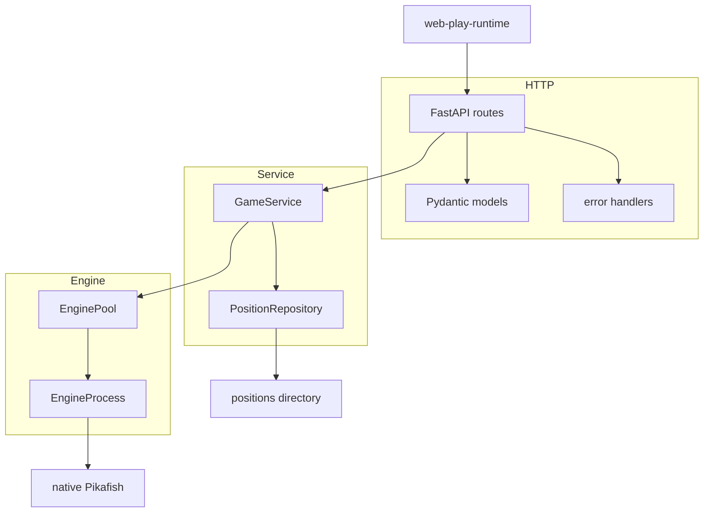
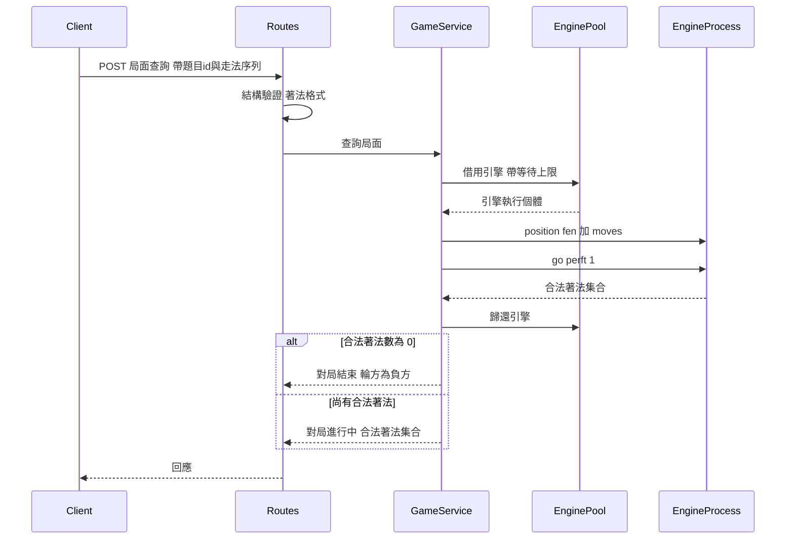
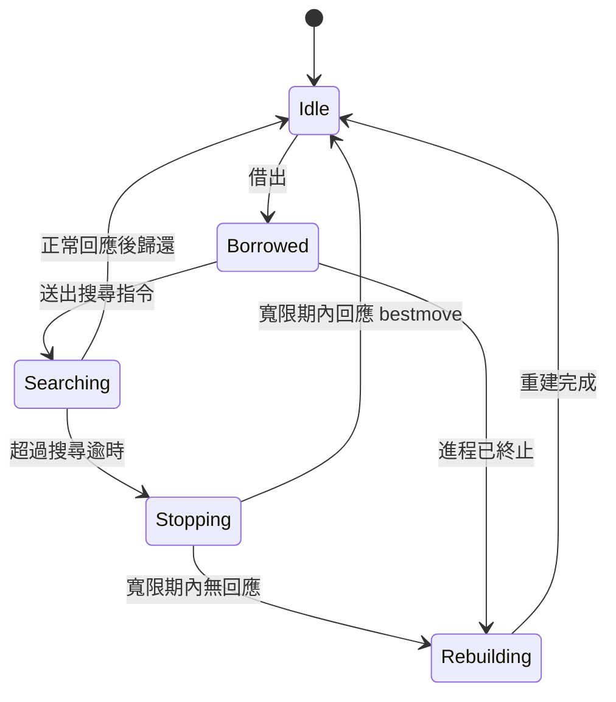

# Design Document — engine-service

## Overview

**Purpose**: 本功能為 leetchess 提供引擎後端,使前端對局 client 能取得任一局面的合法著法、黑方應手與終局結果,支撐使用者把一題排局一路下到分出勝負。

**Users**: 直接使用者為前端對局 client(web-play-runtime);間接受益者為練習排局的終端使用者與維運服務的操作者。

**Impact**: 將 `poc/server.py` 的單進程序列化架構,替換為以引擎進程池為核心的服務。POC 已驗證的 UCI 用法完整保留;併發、逾時、失效恢復與錯誤模型為新建。

### Goals

- 多名使用者同時對局時,請求互不排隊,單一應手請求延遲穩定可預期
- 引擎異常終止或卡死後自動恢復,服務不因單次失敗而停止
- 提供可由 client 程式判別的錯誤類別,取代 POC 直接回傳例外字串的做法
- 題目依 id 載入,題庫擴充至 500 題不需修改程式或設定

### Non-Goals

- **濫用防護、引擎版本啟動校驗、可觀測性**(requirements.md `## Backlog` 的 7、8、9)—— 本輪不實作,不得為其建立元件或預留抽象層
- 走脫判定表與移動級「就是這一步」回饋 —— 後續 phase
- 對局 session 狀態、悔棋記憶、單次挑戰內的應手穩定性 —— 由前端持有
- 部署、託管、監控告警 —— 屬 service-deploy-ops

## Boundary Commitments

### This Spec Owns

- **引擎進程的生命週期**:啟動、借還、健康判定、崩潰後重建
- **UCI 協定層**:指令送出與輸出解析(合法著法、bestmove、mate 與 cp 分數)
- **對局推進的判定**:輪方推導、真終局與負方認定、三態信號的分類
- **HTTP API 契約與錯誤模型**:請求與回應結構、錯誤類別的定義與穩定性
- **題目索引**:由 `positions/` 建立 id 到題目的映射,並依 id 提供起始局面

### Out of Boundary

- **象棋規則的任何實作** —— 合法著法與勝負一律由引擎判定,循環規則(長將、長捉、一將一殺)絕不自行處理
- **任何 session 或對局進度狀態** —— 服務對每個請求無記憶,前端每次重送完整走法序列
- **題目 schema 的定義與題目內容** —— 屬 position-corpus;本服務只讀取,不寫入
- **`max_dtm` 與 `solvable` 的產出** —— 屬 corpus-verification
- **速率限制、版本校驗、健康端點與結構化日誌** —— 已列 Backlog,本輪不實作
- **部署設定、資源配額、監控告警** —— 屬 service-deploy-ops

### Allowed Dependencies

- `engine/` 的 native Pikafish binary 與 `pikafish.nnue`(經 `engine/fetch.sh` 取得)
- `positions/` 的題目資料(唯讀)
- `.kiro/steering/tech.md` 所定的引擎調用慣例與 uv + venv 規範
- 第三方:FastAPI、Pydantic、uvicorn

**約束**:依賴方向為 `types → config → positions/engine → service → http`,各層只能向左依賴。UCI 協定層不得認識 HTTP 概念;HTTP 層不得直接操作引擎進程。

### Revalidation Triggers

以下變更須通知下游(web-play-runtime)重新檢查整合:

- API 請求或回應結構變更,包含新增必填欄位
- 錯誤類別的新增、移除或語意變更
- 三態信號的分類規則或欄位變更
- 題目起始局面回應所含欄位的變更
- 服務忙碌與逾時的回報方式變更
- 啟動前提變更(例如新增必要的環境設定)

## Architecture

### Existing Architecture Analysis

`poc/server.py` 確立了三項仍然有效的用法,本設計原樣保留:

- 引擎 stateless:每次重送 `position fen <fen> moves <...>`
- 合法著法與真終局:`go perft 1`,合法著法數為 0 即輪方負
- 黑方應手與信號:`go nodes N`,解析 `score (mate|cp) N`

需要替換的技術債:

| POC 現況 | 問題 | 本設計的處理 |
|---|---|---|
| 單進程配 `threading.Lock` | 請求全序列化,違反 3.2 | 引擎進程池 |
| `_read_until` 阻塞無逾時 | 引擎不輸出即執行緒永久卡死 | 讀取加逾時上界 |
| `POSITION_FILE` 硬編 | 只能載入單一題目 | 啟動時建立 id 索引 |
| 走法序列走 query string | 長局 URL 過長 | 改用請求主體 |
| `except Exception` 回傳字串 | 無錯誤模型,client 無法判別 | 錯誤類別列舉 |
| **未驗證走法序列** | **引擎靜默忽略非法著法,回傳錯誤局面的合法著法** | **以 `d` 指令比對實際套用步數** |

#### 引擎對非法著法的實際行為(實測)

Pikafish 對 `position fen <fen> moves <...>` 中的非法著法**靜默忽略,不回報任何錯誤**,並以它實際解析到的局面繼續回應後續指令:

```
moves f8f9(合法)  →  go perft 1 回傳 2 個合法著法(走後局面)
moves a1a2(非法)  →  go perft 1 回傳 44 個合法著法(起始局面)
```

**這個失敗模式比拋錯危險得多**:服務會把起始局面的合法著法當成當前局面回給前端,使用者看到一盤錯誤的棋而非錯誤訊息,且雙方都不會察覺。

偵測手段為 `d` 指令 —— 它輸出當前局面的 FEN,其中 `side_to_move` 與 fullmove number 可推出實際套用了幾步:

```
走 1 步    Fen: ... b - - 1 1     預期 side=b, fullmove=1   相符
走 3 步    Fen: ... w - - 0 2     預期 side=w, fullmove=2   相符
非法忽略   Fen: ... w - - 0 1     預期 side=b, fullmove=1   不符,偵測到
```

推導規則(起始為紅先、fullmove 為 1 時):走 `N` 步後 `fullmove = 1 + N // 2`,`side` 於 `N` 為偶數時是紅、奇數時是黑。halfmove clock **不可用於此判斷** —— 它會因吃子而重置。

### Architecture Pattern & Boundary Map



**Architecture Integration**:

- **Selected pattern**:分層架構配資源池。分層使 UCI 協定層可獨立測試且不認識 HTTP;資源池將稀缺資源的管理集中於一處。
- **Domain boundaries**:HTTP 層只做結構驗證與錯誤映射;服務層持有對局判定規則;引擎層只管進程與協定,不知道「對局」概念。
- **Existing patterns preserved**:`tech.md` 的 `EngineAdapter` 抽象由 `EngineProcess` 實現;stateless 用法貫穿全層。
- **New components rationale**:`EnginePool` 為併發與失效恢復的唯一責任點;`PositionRepository` 使題目載入與題庫佈局解耦。
- **Steering compliance**:三個不可動搖的約束(stateless、勝負不自實作、循環規則不自實作)在各層均未違反。

### 併發閘門的位置

引擎池容量是**唯一**的併發閘門。請求向池借用引擎並附帶等待上限:借到即處理,等待逾時即回報服務忙碌。

HTTP 層的 threadpool 容量必須配置為**大於**池容量。否則請求會在觸及池之前先被 threadpool 卡住,產生與資源實況脫節的行為,且錯誤語意模糊。

### 請求的時間預算

3.3 的等待上限與 4.1 的搜尋逾時是分項約束,但 client 感受到的是總和。設計以**單一請求的總時間預算**為頂層約束,各分項為其子預算:

```
總時間預算  =  借用等待上限  +  搜尋逾時  +  stop 寬限期
```

| 分項 | 約束對象 | 逾時後的行為 | Req |
|---|---|---|---|
| 借用等待上限 | 等待池中出現可用引擎 | 回報服務忙碌 | 3.3 |
| 搜尋逾時 | 單次 `go nodes` 或 `go perft` | 送出 `stop`,進入寬限期 | 4.1 |
| stop 寬限期 | 等待 `stop` 後的 `bestmove` | kill 進程並排入重建 | 4.1, 4.2 |

**約束**:三項之和不得超過總時間預算。配置時以總預算為準向下分配,而非各自獨立設定 —— 否則驗收時無法判定服務是否合格。序列驗證的 `d` 指令沿用搜尋逾時,不另設分項。

### Technology Stack

| Layer | Choice / Version | Role in Feature | Notes |
|-------|------------------|-----------------|-------|
| Backend / Services | Python(依 `.python-version`)+ FastAPI + Pydantic v2 | HTTP 契約、結構驗證、型別安全 | 同步 `def` 路由自動使用 threadpool,不需手動 `run_in_executor` |
| Infrastructure / Runtime | uvicorn | ASGI 伺服器 | threadpool 容量須顯式配置為大於引擎池容量 |
| Engine | native Pikafish(`ENGINE_VERSION` 鎖定) | 合法著法、應手、mate 分數 | 經 `subprocess` 長駐,stdin/stdout 通訊 |
| Data / Storage | 檔案系統(`positions/`,唯讀) | 題目資料 | 啟動時載入記憶體索引,約 150KB |
| 依賴管理 | uv | 環境與依賴鎖定 | 依 `tech.md`,一律 `uv run` |

**Build vs. Adopt**:UCI 協定層自建。python-chess 的 `chess.engine` 綁定 `chess.Board`(西洋棋),象棋 FEN 無法解析,適配成本高於自建。詳見 `research.md`。

## File Structure Plan

### Directory Structure

```
service/
├── __init__.py
├── main.py              # FastAPI app 組裝、路由、例外處理器、啟動與關閉掛鉤
├── config.py            # 設定:池大小、各項逾時與總時間預算、搜尋節點數、題庫路徑
├── types.py             # 領域型別:Side、Signal、Score、BestMove、GameState 等
├── models.py            # Pydantic 請求與回應模型(HTTP 層專用,依賴 types)
├── errors.py            # 錯誤類別列舉、服務例外型別、對 HTTP 狀態的映射
├── positions.py         # PositionRepository:題庫掃描、id 索引、題目讀取
├── game.py              # GameService:輪方推導、終局判定、信號分類
└── engine/
    ├── __init__.py
    ├── process.py       # EngineProcess:UCI 指令與輸出解析、序列驗證、逾時讀取、健康判定
    └── pool.py          # EnginePool:借還、等待上限、崩潰重建
```

**依賴方向**(各層只能向左依賴):

```
types / errors  →  config  →  positions / engine  →  game  →  models  →  main
```

- `engine/process.py` 只能 import `types.py`、`errors.py`、`config.py`,**不得** import `models.py` 或 `game.py`
- `positions.py` 的 `Position` 使用 `types.Side`,**不得** import `game.py`
- `models.py` 為 HTTP 層的邊界轉換,只有它與 `main.py` 認識 Pydantic

> 領域型別集中於 `types.py` 是刻意的:`Position` 與 `GameState` 都需要 `Side`,若 `Side` 落在 `game.py` 會使 `positions.py` 反向依賴 `game.py`,違反上述方向。

### 新增檔案(專案根)

- `pyproject.toml` — 依賴宣告與 `requires-python`,依 `tech.md` 的 uv 規範
- `.python-version` — Python 版本鎖定
- `uv.lock` — 依賴鎖定,進版本庫

### Modified Files

- `.gitignore` — 新增 `.venv/`
- `.kiro/steering/structure.md` — **須補上 `service/` 目錄說明**。目前 structure.md 的目錄清單缺少後端服務目錄,本 spec 落地後應同步

### 不修改

- `poc/` — POC 功成身退,不隨產品演進,本 spec 不動它

## System Flows

### 對局推進(一手棋的完整往返)



**關鍵決策**:終局判定只依據合法著法數,與任何評分無關 —— 這是 2.4 的實現方式,而非額外的檢查邏輯。

### 引擎借用與逾時



**關鍵決策**:逾時採兩段式。先送 UCI `stop`(標準中止路徑,引擎會回 `bestmove`),寬限期內取得回應則進程健康、可繼續服役;逾期才 kill 並重建。此設計避免每次逾時都付重新載入 51MB NNUE 的代價。重建於背景進行,不阻塞當前請求,池以其餘容量繼續服務(4.3)。

## Requirements Traceability

| Requirement | Summary | Components | Interfaces | Flows |
|-------------|---------|------------|------------|-------|
| 1.1 | 回傳合法著法 | GameService, EngineProcess | 局面查詢 API | 對局推進 |
| 1.2 | 合法著法數為 0 即輪方負 | GameService | 局面查詢 API | 對局推進 |
| 1.3 | 未達真終局不得宣告結束 | GameService | 局面查詢 API | 對局推進 |
| 1.4 | 回傳黑方應手與評分 | GameService, EngineProcess | 黑方應手 API | 對局推進 |
| 1.5 | 輪方為紅時拒絕應手請求 | GameService, errors | 黑方應手 API | — |
| 1.6 | 判定與鎖定引擎版本一致 | EngineProcess | — | — |
| 2.1 | 回傳三態評分狀態 | GameService | 黑方應手 API | — |
| 2.2 | 紅方即將取勝時提供殺著倒數 | GameService | 黑方應手 API | — |
| 2.3 | 未搜得殺著即回報未知 | GameService | 黑方應手 API | — |
| 2.4 | 評分不影響對局結束判定 | GameService | — | 對局推進 |
| 3.1 | 支撐 30 名同時對局使用者 | EnginePool, config | — | 引擎借用 |
| 3.2 | 未達上限時不等待其他請求 | EnginePool | — | 引擎借用 |
| 3.3 | 達上限時回報忙碌不無限期等待 | EnginePool, errors | 全部 API | 引擎借用 |
| 3.4 | 回應時間不超過無併發時 2 倍 | EnginePool, config | — | 引擎借用 |
| 4.1 | 搜尋逾時中止並回報 | EngineProcess, EnginePool | 全部 API | 引擎借用 |
| 4.2 | 引擎異常後自動恢復 | EnginePool | — | 引擎借用 |
| 4.3 | 恢復期間以其餘容量服務 | EnginePool | — | 引擎借用 |
| 4.4 | 單次失敗後維持整體可用 | EnginePool, error handlers | — | — |
| 5.1 | 可程式判別的錯誤類別 | errors, error handlers | 全部 API | — |
| 5.2 | 拒絕格式不合法的著法 | models | 全部 API | 對局推進 |
| 5.3 | 拒絕走不出的走法序列 | GameService, EngineProcess | 全部 API | 對局推進 |
| 5.4 | 錯誤不含路徑堆疊或引擎輸出 | errors, error handlers | 全部 API | — |
| 6.1 | 依 id 回傳起始局面 | PositionRepository | 題目 API | — |
| 6.2 | id 不存在時回報找不到 | PositionRepository, errors | 題目 API | — |
| 6.3 | 擴充至 500 題不需改程式 | PositionRepository | — | — |

## Components and Interfaces

| Component | Domain/Layer | Intent | Req Coverage | Key Dependencies | Contracts |
|-----------|--------------|--------|--------------|------------------|-----------|
| EngineProcess | Engine | 單一引擎進程的 UCI 封裝與健康判定 | 1.1, 1.4, 1.6, 4.1, 5.3 | native Pikafish (P0) | Service |
| EnginePool | Engine | 引擎資源池:借還、併發閘門、崩潰重建 | 3.1–3.4, 4.1–4.4 | EngineProcess (P0) | Service, State |
| GameService | Service | 對局推進判定:輪方、終局、信號分類 | 1.1–1.5, 2.1–2.4, 5.3 | EnginePool (P0), PositionRepository (P0) | Service |
| PositionRepository | Service | 題庫索引與依 id 讀取 | 6.1–6.3 | positions 目錄 (P0) | Service, State |
| HTTP Routes | HTTP | 端點、結構驗證、錯誤映射 | 全部 | GameService (P0) | API |

### Engine 層

#### EngineProcess

| Field | Detail |
|-------|--------|
| Intent | 封裝單一 pikafish 子進程的 UCI 互動,所有等待均有逾時上界 |
| Requirements | 1.1, 1.4, 1.6, 4.1, 5.3 |

**Responsibilities & Constraints**

- 送出 UCI 指令並解析輸出,對外只暴露三個操作
- **任何一次讀取都必須有逾時上界** —— 沒有上界,引擎異常會演變成執行緒洩漏
- **每次送出 `position` 指令後必須驗證序列已完整套用** —— 引擎靜默忽略非法著法(見 Existing Architecture Analysis 的實測),不驗證即產生錯誤資料
- 不認識「對局」「題目」「HTTP」等上層概念
- 進程為 stateless 用法:每次操作重送完整 `position fen <fen> moves <...>`
- 啟動選項固定 `Threads=1`、`Hash=128`,依 `tech.md`

**1.6 的保證方式**:合法著法與勝負判定**全部取自引擎輸出**,服務不實作任何規則邏輯 —— 因此判定必然與所執行的引擎一致,循環規則(長將、長捉、一將一殺)局面亦然。

一致性由「不自實作」保證,**不是**由版本校驗保證 —— 啟動時校驗引擎與 `ENGINE_VERSION` 是否相符屬 Backlog(requirements.md 的 Requirement 8),本輪不實作。這代表本輪服務會忠實反映**所執行的**引擎版本,但不驗證該版本是否為專案鎖定的版本。兩者的差別在題目驗證結果開始被信任後才有實際後果,屆時再補。

**Dependencies**

- External: native Pikafish binary 與 `pikafish.nnue` — 引擎本體 (P0)

**Contracts**: Service [x]

##### Service Interface

型別定義於 `types.py`(見 File Structure Plan 的依賴方向說明):

```python
from dataclasses import dataclass
from enum import Enum

class ScoreKind(str, Enum):
    MATE = "mate"
    CP = "cp"

@dataclass(frozen=True)
class Score:
    kind: ScoreKind
    value: int              # 黑方視角;mate 為負代表黑方將被殺

@dataclass(frozen=True)
class BestMove:
    move: str | None        # UCI 著法;None 代表引擎回報無著可走
    score: Score | None

class EngineProcess:
    def legal_moves(self, fen: str, moves: list[str], timeout: float) -> list[str]: ...
    def best_move(self, fen: str, moves: list[str], nodes: int, timeout: float) -> BestMove: ...
    def is_healthy(self) -> bool: ...
    def terminate(self) -> None: ...
```

- **Preconditions**:`fen` 為引擎可解析的局面;`moves` 中每個元素已通過格式驗證
- **Postconditions**:回傳前進程已回到可接受下一道指令的狀態,或已被標記為不健康
- **Invariants**:
  - 任何方法的等待時間不超過傳入的 `timeout`;逾時後進程狀態明確為健康或待重建
  - **兩個查詢方法在送出 `position` 後、執行查詢前,均先驗證序列已完整套用**;未完整套用即拋出局面不一致錯誤,絕不回傳其他局面的結果(5.3)

##### 序列驗證(內建於兩個查詢方法)

驗證是協定層的內建保證,不是呼叫方的責任 —— 呼叫方無從得知引擎忽略了哪一步。

1. 送出 `position fen <fen> moves <...>`
2. 送出 `d`,解析輸出的 `Fen:` 行
3. 由 `len(moves)` 推導預期的 `side_to_move` 與 fullmove number
4. 與實際值比對,不符即拋出局面不一致錯誤

成本為每次查詢一道額外的 `d` 指令,無搜尋開銷。

**Implementation Notes**

- Integration:UCI 指令序列與輸出解析邏輯移植自 `poc/server.py` 的 `Engine` 類,該部分已驗證正確
- Validation:`legal_moves` 回傳空 list 即輪方無著可走,此為真終局的唯一判準(1.2)
- Risks:`stop` 後引擎回傳 `bestmove` 的延遲缺乏實測依據,寬限期須可配置(見 `research.md`)

#### EnginePool

| Field | Detail |
|-------|--------|
| Intent | 管理固定容量的引擎進程集合,作為服務的唯一併發閘門 |
| Requirements | 3.1, 3.2, 3.3, 3.4, 4.1, 4.2, 4.3, 4.4 |

**Responsibilities & Constraints**

- 維持設定容量的可用引擎;借出與歸還為原子操作
- 借用附等待上限,逾時未借到即拋出忙碌錯誤(3.3),**絕不無限期等待**
- 偵測不健康的進程並於背景重建,重建期間池以其餘容量繼續服務(4.3)
- 單一進程的失敗不得影響其他進程或使服務停止(4.4)

**Dependencies**

- Outbound: EngineProcess — 池所管理的資源 (P0)

**Contracts**: Service [x] / State [x]

##### Service Interface

```python
from contextlib import AbstractContextManager

class EnginePool:
    def __init__(self, size: int, acquire_timeout: float) -> None: ...
    def acquire(self) -> AbstractContextManager[EngineProcess]: ...
    def shutdown(self) -> None: ...
```

- **Preconditions**:`size` 至少為 1;池已完成初始化(所有進程啟動並就緒)
- **Postconditions**:context manager 離開時進程必定歸還或被標記待重建,不會洩漏
- **Invariants**:同一進程不會同時借給兩個請求;可用進程數加借出數加重建中數恆等於 `size`

##### State Management

- **State model**:每個槽位處於 Idle、Borrowed、Rebuilding 之一(見引擎借用流程圖)
- **Persistence**:純記憶體,無持久化
- **Concurrency strategy**:借還以執行緒安全的佇列或號誌實現;重建在背景執行緒進行,不阻塞借用路徑

**Implementation Notes**

- Integration:HTTP 層的 threadpool 容量必須大於池容量,否則會在池之前先形成瓶頸
- Validation:池大小預設值須依實測記憶體佔用決定,不得憑估算(見 Risks)
- Risks:NNUE 記憶體是否隨進程數線性成長尚未驗證,直接影響池大小上限

### Service 層

#### GameService

| Field | Detail |
|-------|--------|
| Intent | 依引擎回傳判定對局狀態,並將評分分類為三態信號 |
| Requirements | 1.1, 1.2, 1.3, 1.4, 1.5, 2.1, 2.2, 2.3, 2.4, 5.3 |

**Responsibilities & Constraints**

- 由起始 FEN 的起手方與走法數推導當前輪方
- **終局判定只依據合法著法數為 0**,與任何評分無關(1.3、2.4)
- 將引擎回傳的評分分類為三態,`cp` 一律歸類為「未搜得殺著」,**不得據以推斷勝負傾向**(2.3)
- 不持有任何跨請求狀態

**Dependencies**

- Outbound: EnginePool — 取得引擎 (P0)
- Outbound: PositionRepository — 取得起始局面 (P0)

**Contracts**: Service [x]

##### Service Interface

領域型別同樣定義於 `types.py` —— `Side` 為 `Position` 與 `GameState` 所共用,若置於 `game.py` 會使 `positions.py` 反向依賴:

```python
from dataclasses import dataclass
from enum import Enum

class Side(str, Enum):
    RED = "red"
    BLACK = "black"

class Signal(str, Enum):
    RED_WINNING = "red_winning"       # 引擎回報黑方將被殺
    BLACK_WINNING = "black_winning"   # 引擎回報黑方可殺
    UNKNOWN = "unknown"               # 未搜得殺著

@dataclass(frozen=True)
class GameState:
    side_to_move: Side
    legal_moves: list[str]
    over: bool
    winner: Side | None

@dataclass(frozen=True)
class BlackReply:
    move: str | None
    signal: Signal
    mate_in: int | None               # 僅 RED_WINNING 時有值
    state: GameState

class GameService:
    def start(self, position_id: int) -> tuple[str, GameState]: ...
    def state(self, position_id: int, moves: list[str]) -> GameState: ...
    def black_reply(self, position_id: int, moves: list[str]) -> BlackReply: ...
```

- **Preconditions**:`position_id` 存在於題庫;`moves` 已通過格式驗證
- **Postconditions**:`over` 為真時 `winner` 必有值,且 `legal_moves` 為空
- **Invariants**:`over` 的值只由 `legal_moves` 是否為空決定,`signal` 的任何取值都不影響它

**Implementation Notes**

- Integration:輪方推導沿用 POC 的做法(起手方加走法數的奇偶)
- Validation:`black_reply` 在輪方為紅時拋出輪方不符錯誤(1.5);走法序列走不出時由**協定層的序列驗證**偵測並拋出局面不一致錯誤(5.3)—— 引擎本身不會回報,見 EngineProcess 的序列驗證
- Risks:信號分類依賴引擎回傳的分數視角為黑方,此假設須在協定層測試中固定下來

#### PositionRepository

| Field | Detail |
|-------|--------|
| Intent | 由分書目錄建立 id 索引,依 id 提供題目 |
| Requirements | 6.1, 6.2, 6.3 |

**Responsibilities & Constraints**

- 啟動時遞迴掃描 `positions/`,建立 id 到題目的記憶體索引
- **偵測重複 id 並拒絕啟動** —— id 全域唯一由人工保證,此檢查使錯誤在部署階段暴露而非執行期
- 唯讀:不寫入題庫任何欄位
- 新增題目只需放入檔案,不需修改程式或設定(6.3)

**Dependencies**

- External: `positions/` 目錄 — 題目資料來源 (P0)

**Contracts**: Service [x] / State [x]

##### Service Interface

`Position` 與其餘領域型別同樣定義於 `types.py`,本區塊僅示意其結構。`positions.py` 由此匯入,不重複定義:

```python
from dataclasses import dataclass

@dataclass(frozen=True)
class Position:
    id: int
    title: str
    description: str
    fen: str
    side_to_move: Side
    difficulty: int
    tags: list[str]
    max_dtm: int | None
    solvable: bool | None

class PositionRepository:
    def load(self) -> None: ...            # 啟動時呼叫,建立索引
    def get(self, position_id: int) -> Position: ...
```

- **Preconditions**:`load()` 已於服務啟動時完成
- **Postconditions**:`get()` 對不存在的 id 拋出題目不存在錯誤(6.2)
- **Invariants**:索引在服務生命週期內不變;同一 id 只對應一個題目

**Implementation Notes**

- Integration:題目 schema 由 `structure.md` 定義,本元件只讀取不定義
- Validation:`max_dtm` 與 `solvable` 可為空(尚待 corpus-verification 回填),不得視為必填
- Risks:題庫檔案損毀或 schema 不符時,應於啟動掃描階段失敗,而非在使用者請求時才暴露

### HTTP 層

#### Routes

**Contracts**: API [x]

##### API Contract

| Method | Endpoint | Request | Response | Errors |
|--------|----------|---------|----------|--------|
| GET | `/api/positions/{id}` | — | 起始局面與題目資訊 | 404, 503 |
| POST | `/api/state` | 題目 id 與走法序列 | 輪方、合法著法、是否結束、勝方 | 400, 404, 409, 503, 504 |
| POST | `/api/black-move` | 題目 id 與走法序列 | 黑方著法、三態信號、殺著倒數、後續局面 | 400, 404, 409, 503, 504 |

**走法序列以請求主體傳遞**,不走 query string —— 長局的序列會使 URL 過長。

##### 典型流程:每手棋只需一次呼叫

使用者走完一手紅方著法後,**直接呼叫 `/api/black-move` 即可**,不需要先呼叫 `/api/state` 確認是否終局。

`/api/black-move` 的回應已涵蓋紅方這一手就將死黑方的情況:此時黑方著法為空、局面標記為結束、勝方為紅。排局的最後一手正是這個情形,因此這不是邊緣案例而是每一題的必經路徑。

`/api/state` 的用途是**重建狀態**而非推進對局:

- 悔棋後回到某個歷史局面
- 頁面重新整理後依走法序列還原
- 載入題目後確認起始局面的合法著法

**這個區分直接影響併發**:若前端每手都先 `state` 再 `black-move`,通過併發閘門的次數會加倍,壓縮 3.1 的可承載人數。實作與前端整合時須遵守此流程。

##### 錯誤類別

所有錯誤回應含穩定的機器可讀類別碼,client 據此決定 UI 行為(5.1)。錯誤回應**不得包含內部路徑、堆疊追蹤或引擎原始輸出**(5.4)。

| 類別碼 | HTTP | 觸發條件 | Req |
|---|---|---|---|
| `INVALID_MOVE_FORMAT` | 400 | 著法不符 UCI 格式 | 5.2 |
| `POSITION_NOT_FOUND` | 404 | 題目 id 不存在 | 6.2 |
| `ILLEGAL_MOVE_SEQUENCE` | 409 | 走法序列在該局面走不出 | 5.3 |
| `WRONG_SIDE_TO_MOVE` | 409 | 請求黑方應手但輪方為紅 | 1.5 |
| `SERVICE_BUSY` | 503 | 等待上限內未借到引擎 | 3.3 |
| `ENGINE_TIMEOUT` | 504 | 搜尋超過逾時上限 | 4.1 |
| `INTERNAL` | 500 | 其他未預期失敗 | 5.1, 5.4 |

**Implementation Notes**

- Integration:著法格式驗證由 Pydantic 模型完成,在進入服務層之前攔截(5.2)
- Validation:全域例外處理器確保任何未捕捉的例外都轉為 `INTERNAL`,絕不外洩內部細節(5.4、4.4)
- Risks:同步 `def` 路由的 threadpool 容量若小於引擎池容量,會使 `SERVICE_BUSY` 無法正確反映資源實況

## Error Handling

### Error Strategy

錯誤分三類處理:**輸入錯誤**在 HTTP 層攔截、**業務判定錯誤**由服務層拋出、**資源與引擎錯誤**由引擎池拋出。三者統一經全域例外處理器映射為錯誤類別碼。

### Error Categories and Responses

- **輸入錯誤(400)**:著法格式不符 → 指出不合法的著法,client 可直接顯示
- **業務判定錯誤(404、409)**:題目不存在、走法序列走不出、輪方不符 → client 可據此重置或提示
- **資源錯誤(503)**:引擎池滿 → client 應提示稍後重試,此為預期中的暫時狀態而非故障
- **引擎錯誤(504)**:搜尋逾時 → client 可重試;服務端同時觸發該進程的健康檢查
- **未預期錯誤(500)**:一律轉為 `INTERNAL`,不含任何內部細節

**單次失敗不影響服務可用性**(4.4):任何路徑的失敗都必須確保引擎已歸還或標記待重建,絕不因例外而洩漏池中資源。

### Monitoring

健康端點與結構化日誌屬 Backlog(9),本輪不實作。開發階段以標準輸出觀察即可。

## Testing Strategy

### Unit Tests

- **UCI 輸出解析**:`go perft 1` 輸出轉合法著法集合;`score mate -N` 與 `score cp X` 的解析與視角(對應 1.1、2.1–2.3)
- **三態信號分類**:mate 負值歸 `RED_WINNING` 並帶殺著倒數、mate 正值歸 `BLACK_WINNING`、cp 一律歸 `UNKNOWN`(對應 2.1、2.2、2.3)
- **終局判定與信號無關**:給定合法著法非空但評分為 mate 的局面,`over` 必為 false(對應 1.3、2.4)
- **輪方推導**:起手方與走法數的各種組合(對應 1.5)
- **題庫索引**:分書目錄掃描、重複 id 偵測導致啟動失敗、不存在 id 拋出錯誤(對應 6.1、6.2、6.3)

### Integration Tests

- **一整局走到真終局**:以《適情雅趣》第 21 局自起始局面走至紅勝,驗證停局時機與勝方認定(對應 1.1、1.2、1.3)
- **輪方不符的應手請求**:輪方為紅時請求黑方應手,回傳 `WRONG_SIDE_TO_MOVE`(對應 1.5)
- **走不出的走法序列**:送入該局面不合法的序列,回傳 `ILLEGAL_MOVE_SEQUENCE`。**必須斷言回應不是其他局面的合法著法** —— 引擎靜默忽略非法著法,若驗證失效,失敗模式是回傳起始局面的資料而非拋錯,單純斷言「有錯誤」的測試抓不到(對應 5.3)
- **序列驗證的推導規則**:走 N 步後的預期 `side_to_move` 與 fullmove number,涵蓋含吃子的序列(halfmove clock 會重置,不得用於判斷)(對應 5.3)
- **搜尋逾時路徑**:以人為卡住的假引擎驗證逾時觸發、回傳 `ENGINE_TIMEOUT`、且進程進入重建(對應 4.1、4.2)
- **崩潰恢復**:強制終止池中一個進程,驗證服務持續可用且該槽位於背景重建(對應 4.2、4.3、4.4)
- **錯誤不外洩內部細節**:製造各類錯誤,斷言回應中不含檔案路徑、堆疊或引擎原始輸出(對應 5.4)

### Performance / Load

- **併發不排隊**:池容量內的同時請求,驗證後到的請求不等待先到者完成(對應 3.2)
- **回應時間上界**:池容量內的併發下,單一應手請求耗時不超過無併發時的 2 倍(對應 3.4)
- **池滿即拒絕**:超過池容量加等待佇列的請求,於等待上限內回傳 `SERVICE_BUSY` 而非無限期等待(對應 3.3)
- **30 名同時對局使用者**:以回合制節奏(使用者思考期間不發請求)模擬,驗證服務維持正常(對應 3.1)
- **記憶體佔用實測**:量測單進程與多進程的實際 RSS,確認 NNUE 是否隨進程數線性成長,據以定池大小預設值

## Performance & Scalability

**負載模型**:排局對局為回合制,使用者思考期間不發請求。3.1 的「30 名同時對局使用者」換算後的**瞬時並行搜尋數遠低於 30** —— 若使用者平均每十餘秒走一手而單次搜尋約 0.2 秒,瞬時並行數為個位數以下。

因此池大小應依**瞬時並行數**設定,以等待佇列吸收突發,而非以池大小硬扛在線人數。這是 3.1 與 3.4 能同時成立的原因。

**記憶體上界**:每個引擎進程 `Hash 128MB` 加 51MB NNUE。若 NNUE 各進程獨立載入,池大小 N 的記憶體約為 `N × 179MB`。**此假設尚未驗證**,實作第一步即應實測,部署規格以實測為準。

---

## Supporting References

- `research.md` — 完整的 discovery 記錄:python-chess 不適用的驗證、併發模型調查、POC 可複用性分析、四項設計決策與風險清單
- `.kiro/steering/tech.md` — 三個不可動搖的約束、引擎調用慣例、uv + venv 規範、授權約束
- `.kiro/steering/structure.md` — `positions/` 分書佈局與題目 schema
- `poc/server.py` — UCI 用法的既有驗證來源
