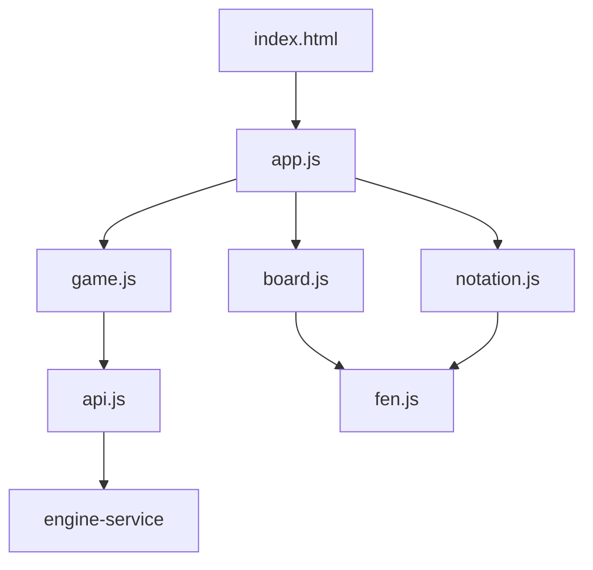

# Design Document — web-play-runtime

## Overview

**Purpose**: 提供使用者實際操作的單題對局介面 —— 載入題目、執紅走子、引擎執黑應手、真終局停局判勝負,過程中呈現三態諮詢信號。這是產品第一個面向使用者的部分。

**Users**: 練習排局的終端使用者。

**Impact**: 後端已完成但沒有任何棋盤介面,產品目前只能用 `curl` 操作。本功能補上這一層,使產品首次可用。

### Goals

- 使用者能完整下完一題,只在真終局停局
- 網路慢或失敗時使用者清楚知道發生什麼事,且能繼續操作
- 維持專案無 node 工具鏈,交付物就是 `.html` / `.js` / `.css` 本身

### Non-Goals

- **悔棋與應手記憶** —— 產品決定不做(`product.md`),不得為其預留任何結構
- 跨題導航、題目列表、練習進度 —— 屬 problem-browser
- 走脫判定表與移動級回饋 —— 後續 phase,但回饋來源須可擴充
- 任何象棋規則的自行判斷

## Boundary Commitments

### This Spec Owns

- `web/` 底下的全部內容:頁面、樣式、所有前端模組
- **對局狀態**:題目、走法序列、當前局面、信號、等待態 —— 前端是唯一真相
- 後端 API client:請求、逾時、取消、兩種錯誤形狀的辨識
- 盤面呈現與走子互動、中文記譜、三態信號的呈現
- **`service/main.py` 中掛載 `web/` 的那一小段**(見下方 Allowed Dependencies 的說明)

### Out of Boundary

- 後端任何行為 —— 端點、對局判定、引擎、題庫都屬 engine-service
- **任何象棋規則** —— 合法著法與勝負一律來自後端,包含循環規則
- 題目 schema 與題庫內容 —— 屬 position-corpus
- 決定載入哪一題 —— 由外部指定,跨題導航屬 problem-browser
- **悔棋、單手回退、應手記憶** —— 明確不做

### Allowed Dependencies

- engine-service 的三個端點與錯誤契約(唯讀消費,不得要求後端為前端改變行為)
- 瀏覽器原生能力:ES modules、`fetch`、`AbortController`、SVG
- 測試:`playwright`(Python 綁定,經 uv 管理)

**跨目錄改動的唯一例外**:本 spec 會在 `service/main.py` 加入靜態檔掛載。這是 `service/` 與 `web/` 的唯一實體交界(`structure.md` 已記載),必須是**明確的整合任務**,不得夾帶在前端任務中。engine-service 只提供掛載點,不擁有前端內容。

**禁止**:引入任何 node 工具鏈、打包器、前端框架(`tech.md`)。

### Revalidation Triggers

以下變更須回頭檢查本功能:

- 後端三個端點的請求或回應結構變更
- 錯誤類別碼的新增、移除或語意變更
- 三態信號的分類規則或欄位變更
- 靜態檔掛載路徑或方式變更
- 產品層面恢復悔棋 —— 屆時應手記憶與應手穩定性必須一併回來

## Architecture

### 模組結構與依賴方向



**依賴方向**(各層只能向左依賴):

```
fen / notation  →  board / api  →  game  →  app
```

`fen.js` 與 `notation.js` 是純函式,不碰 DOM 也不發請求 —— 這使它們能以 `page.evaluate()` 單獨驗證。`board.js` 只接受資料並繪製,自身不記憶任何狀態。

### 唯一真相:走法序列

`game.js` 持有整個對局的可變狀態,其中**走法序列是唯一的真相來源**:盤面、輪方、歷史著法全部由它推導。

這使三件事退化成同一個操作 —— 換掉走法序列後重繪:

| 情境 | 操作 |
|---|---|
| 重來 | 走法序列清空 |
| 狀態重建 | 走法序列由外部給定 |
| 取消 / 失敗復原 | 走法序列退回送出前的值 |

若呈現層各自持有狀態,這三條路徑會各自需要清理邏輯,而清理不乾淨正是「畫面卡在不可知狀態」的來源(requirements 7.4)。

### 每手棋一次請求

使用者走出一手後**直接呼叫黑方應手端點**,不先查詢局面狀態。該回應已涵蓋「紅方這一手就將死黑方」(對手著法為空、對局結束、勝方為紅),而那是每一題排局的最後一手,不是邊緣案例。

多一次呼叫會讓通過後端併發閘門的次數加倍,直接壓縮服務可承載人數。局面查詢端點只用於**狀態重建**。

### 取消的語意不對稱

使用者取消等待時,前端停止等待該回應並把走法序列退回送出前的值。**後端不會因此中止那次搜尋** —— 它仍會跑完並佔用池容量到結束為止。

這是刻意接受的不對稱:requirements 6.3 只要求前端回到可操作狀態。**不要誤以為取消能省下後端資源**;若日後需要真正中止,得先在後端契約加入取消機制。

### Technology Stack

| Layer | Choice | Role | Notes |
|-------|--------|------|-------|
| 前端 | vanilla JS(ES modules)+ SVG | 全部前端邏輯與盤面繪製 | **無建置步驟**,`.js` 直接就是交付物(`tech.md`) |
| 樣式 | 原生 CSS | 版面與行動裝置適配 | 無預處理器 |
| 交付 | 後端掛靜態檔 | 與 API 同源,免 CORS | 掛載段由本 spec 加入 `service/main.py` |
| 測試 | `playwright`(Python 綁定) | 真實瀏覽器的端到端與純函式驗證 | 經 uv 管理,**不需要 node**;併入既有 pytest 套件 |

## File Structure Plan

### 新增檔案

```
web/
├── index.html       # 頁面骨架、版面容器、模組進入點
├── style.css        # 版面與行動裝置適配
├── fen.js           # FEN 解析、著法套用到盤面陣列(純函式)
├── notation.js      # UCI 轉中文記譜(純函式,自 POC 移植)
├── board.js         # SVG 棋盤繪製、選子與合法落點標示
├── api.js           # 後端 client:請求、逾時、取消、兩種錯誤形狀的辨識
├── game.js          # 對局狀態機:走法序列、推進、重來、狀態重建
└── app.js           # 組裝與事件綁定
```

```
tests/
├── conftest_web.py       # Playwright 夾具:啟動頁面、攔截後端
├── test_web_pure.py      # 純函式:FEN 解析、中文記譜(page.evaluate)
├── test_web_play.py      # 互動:走子、推進、終局、重來、狀態重建
└── test_web_failures.py  # 失敗路徑:逾時、斷線、忙碌、序列不一致、取消
```

### 修改檔案

- `service/main.py` — **加入 `web/` 的靜態檔掛載**。這是本 spec 唯一的跨目錄改動,必須是獨立的整合任務
- `pyproject.toml` — 加入 `playwright` 開發依賴

### 自 POC 移植的內容

`poc/index.html` 的六個函式合計約 150 行為純呈現邏輯,直接移植:`parseFen`、`applyMove`(→ `fen.js`)、`drawGrid`、`render`(→ `board.js`)、`uci2cn`、`renderMoves`(→ `notation.js`)。

**POC 的 `api()`、`humanMove()`、`start()` 整份丟棄** —— 綁死舊端點與 query string,且無逾時、取消與錯誤模型。`renderSignal` 重寫:新契約給的是已分類的 `signal` 與 `mate_in`,前端不再需要自己判斷 mate 正負。

`poc/` 本身不改動,功成身退。

## Requirements Traceability

| Requirement | Summary | Components |
|---|---|---|
| 1.1, 1.5 | 起始盤面、紅方在下 | board.js, fen.js |
| 1.2, 1.3 | 局名出處、殺著距離 | app.js |
| 1.4 | 題目不存在的告知 | api.js, app.js |
| 2.1, 2.2, 2.3 | 選子、落點、無效點擊 | board.js, game.js |
| 2.4 | 合法著法唯一來自後端 | game.js |
| 2.5 | 非我方回合不接受走子 | game.js |
| 3.1 | 單一請求取得應手與後續狀態 | game.js, api.js |
| 3.2, 3.4 | 終局呈現勝方 | game.js, app.js |
| 3.3 | 不因信號提早結束 | game.js |
| 3.5 | 每次重送完整序列 | game.js, api.js |
| 4.1, 4.2 | 三態呈現、倒數為零仍呈現 | app.js |
| 4.3 | 信號不影響終局判定 | game.js |
| 4.4 | 信號可辨識為參考資訊 | index.html, style.css |
| 4.5 | 走脫回饋來源可擴充 | game.js |
| 5.1 | 重來 | game.js |
| 5.2 | 不提供單手回退 | game.js |
| 5.3 | 狀態重建 | game.js, api.js |
| 5.4 | 重建時序列失效 | game.js, app.js |
| 6.1, 6.2 | 等待呈現、等待中不接受走子 | app.js, game.js |
| 6.3 | 取消回到送出前 | api.js, game.js |
| 6.4 | 等待態必被解除 | game.js |
| 7.1, 7.2, 7.3 | 逾時、忙碌、序列不一致 | api.js, app.js |
| 7.4 | 失敗後維持可操作 | game.js |
| 7.5, 7.6 | 不呈現原始錯誤、無法辨識的格式 | api.js |
| 8.1 | 中文記譜 | notation.js |
| 8.2 | 行動裝置版面 | style.css |
| 8.3, 8.4 | 繁體中文、輪方可辨識 | index.html, app.js |

## Components and Interfaces

| Component | Intent | Req Coverage | Dependencies |
|---|---|---|---|
| fen.js | FEN 與盤面陣列的互轉、著法套用 | 1.1, 1.5 | 無(純函式) |
| notation.js | UCI 轉中文記譜 | 8.1 | fen.js |
| board.js | SVG 棋盤繪製與選子互動 | 1.1, 1.5, 2.1–2.3 | fen.js |
| api.js | 後端 client 與錯誤辨識 | 1.4, 3.1, 3.5, 6.3, 7.1–7.6 | 無 |
| game.js | 對局狀態機 | 2.4, 2.5, 3.x, 4.3, 4.5, 5.x, 6.x, 7.4 | api.js |
| app.js | 組裝、事件綁定、呈現 | 1.2–1.4, 3.2, 4.1–4.2, 8.3–8.4 | game.js, board.js, notation.js |

### api.js

**責任**:唯一與後端往來的地方。每次請求帶逾時上界與可取消性,並把後端的兩種回應形狀收斂成統一的失敗表示。

**關鍵約束**:

- 後端錯誤有**兩種形狀** —— 端點錯誤為 `{code, message}`(七種碼之一),路由層 404/405 為框架原生的 `{"detail": ...}`。任何無法辨識的形狀一律歸為通用錯誤(7.6),**不得把原始內容呈現給使用者**(7.5)
- 每次請求都要有逾時上界,逾時與斷線都轉為可辨識的失敗(7.1)
- 支援取消(6.3)。取消只影響前端是否等待,不會中止後端搜尋

### game.js

**責任**:持有唯一的對局狀態,對外只暴露「做一件事」的操作。

**關鍵約束**:

- **終局只依據後端回應中的 `over`**,絕不因 `signal` 為任何值而提早結束(3.3、4.3)。這與後端的結構性保證對應 —— 後端的終局判定裡沒有分數,前端也不得引入
- **不提供任何單手回退**(5.2)。狀態只能整體前進、清空或整體替換
- 走法序列是唯一真相,每次請求重送完整序列(3.5)
- 走脫回饋的來源須可擴充:目前只有 `signal`,日後判定表是**新增來源**而非改寫推進流程(4.5)
- 任何失敗之後狀態必須回到可操作(7.4),等待態必被解除(6.4)

### app.js

**關鍵約束**:

- **`mate_in` 可能為 `0`**(終局那手)。JS 的 `if (mateIn)` 對 0 為假 —— 一律以 `!= null` 判斷,否則終局那手的倒數會被靜默吞掉(4.2)
- **對手著法為 `null` 時 `signal` 仍可能有值**,兩者獨立呈現
- 殺著倒數以**近似值**形式呈現(「約 N 步」),因為後端在 250k 節點下可能高估 1 步
- 信號的呈現須讓使用者辨識它是參考資訊而非勝負判決(4.4)

## Error Handling

| 情境 | 使用者看到 | 可做什麼 |
|---|---|---|
| 逾時 / 斷線 | 連線有問題 | 重試 |
| 服務忙碌(503) | 服務忙碌,稍後再試 | 重試(與真正的錯誤區分,7.2) |
| 序列不一致(409) | 對局狀態已失效 | 重來(7.3) |
| 題目不存在(404) | 找不到題目 | —— |
| 其他已知錯誤碼 | 通用錯誤訊息 | 重試 |
| 無法辨識的回應 | 通用錯誤訊息(7.6) | 重試 |

**共同保證**:任何失敗之後介面維持可操作(7.4)、等待態解除(6.4)、不呈現後端原始內容或技術細節(7.5)。

## Testing Strategy

測試以 Playwright 的 Python 綁定執行,併入既有 pytest 套件。多數測試以 `page.route()` 攔截後端 —— 逾時、斷線、503 這些路徑無法用真實服務穩定觸發。

### 純函式(`page.evaluate()`)

- FEN 解析與著法套用:起始局面、含吃子的著法
- **中文記譜**:同線雙車、雙馬、兵的前後子判別,以及進退平 —— **不預設 POC 的實作是對的**,移植時一併補上針對性測試

### 互動

- 走完一整局到真終局,驗證只在終局停局、勝方正確
- **信號為 mate 時對局仍繼續**(3.3、4.3)——這是與後端對應的核心保證
- **`mate_in` 為 0 時倒數仍呈現**(4.2)——JS 的 falsy 陷阱
- 選取非己方棋子或未標示位置時盤面不變、不送請求(2.3)
- 等待中不接受走子(6.2);非我方回合不接受走子(2.5)
- 重來後回到起始局面且歷史清空(5.1)
- 狀態重建:給定走法序列後盤面與歷史正確(5.3)

### 失敗路徑

- 逾時、斷線、503、409、404 各自的呈現與可復原性
- **無法辨識的回應形狀**(模擬路由層的 `{"detail": ...}`)歸為通用錯誤,不呈現原始內容(7.5、7.6)
- 取消後回到送出前的局面並恢復接受走子(6.3)
- **連續多次失敗後介面仍可操作**(7.4)——單次不足以證明

### 版面

- 行動裝置直向畫面完整呈現盤面與對局資訊,不需橫向捲動(8.2)
